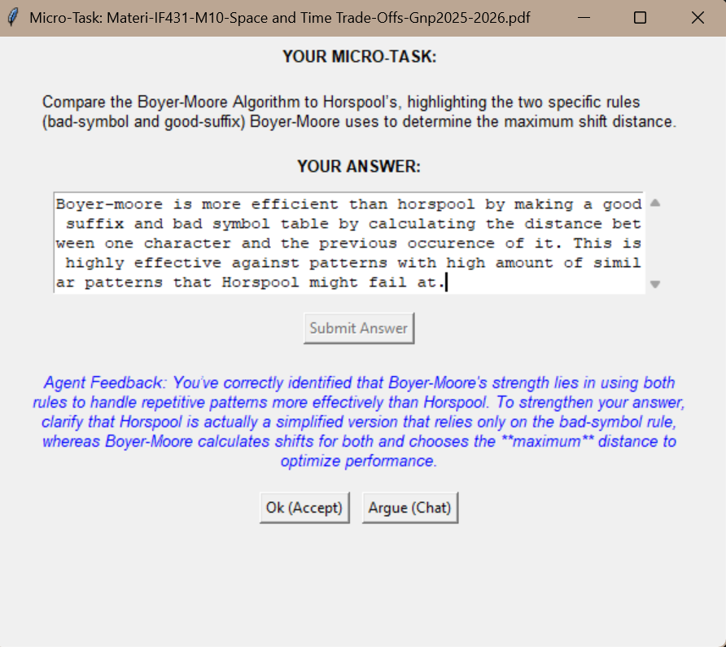
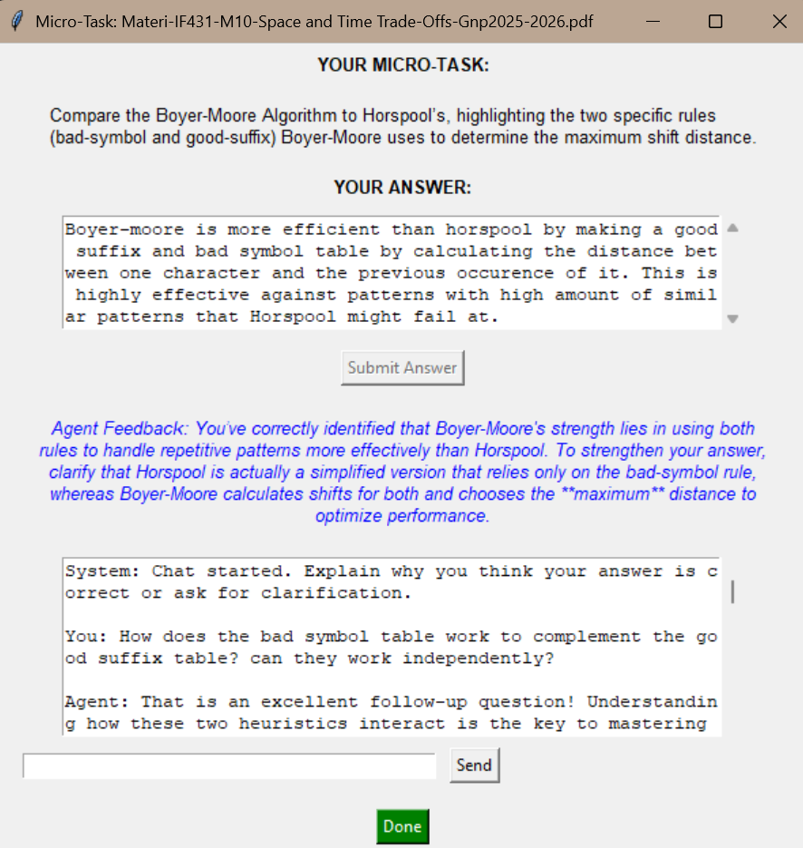

# UMicroassigNment - Anti-Procrastination Micro-Assignment Agent

Need to learn but don't feel like it? UMNMicroassigNment is here to help! This project is a proof-of-concept for an AI agent that breaks down large assignments or study materials into small, manageable tasks and delivers them to you via Windows toast notifications at randomized intervals. The goal is to make studying less overwhelming and more consistent, helping you stay on track without feeling like you're facing a mountain of work.

This project is made for students who want to stay on top of their studies without the stress of procrastination. By breaking down your materials into bite-sized pieces and prompting you regularly, UMNMicroassigNment helps you make steady progress and keeps you motivated.

## Features

- **Automated Decomposition**: The agent uses the Google Gemini API to analyze your study materials and break them down into 3-7 small tasks or questions.
- **Randomized Notifications**: You receive Windows Toast notifications every 15 minutes to 2 hours (Configurable), prompting you to complete one small task at a time.
- **Progress Tracking**: The agent keeps track of your progress in a local JSON file, ensuring you can pick up where you left off.
- **Final Compilation**: Once all micro-tasks are completed, the agent compiles your answers into a cohesive, clear document using Gemini.





## How It Works

1. **Material Drops**: Drop your study materials (text or markdown files) into the `materials/` folder.
2. **Decomposition**: Using the Google Gemini API, the agent analyzes the content and breaks it into 3-7 small tasks or questions.
3. **Micro-Prompting**: Every 15 minutes to 2 hours (randomized), the agent triggers a Windows Toast notification to remind you to do one small piece of the work.
4. **Compilation**: Once you've finished all micro-tasks, the agent uses Gemini to weave your answers into a cohesive, formal academic document (`final_[filename].md`).

## Prerequisites

- Python 3.8+
- Google Gemini API Key

## Installation

1. Install dependencies:
   ```bash
   pip install -r requirements.txt
   ```
2. Create a `.env` file with your API key:
   ```env
   GEMINI_API_KEY=your_actual_api_key_here
   ```

## Usage

1. Create the `materials/` folder if it doesn't exist.
2. Run the agent:

```bash
python agent.py
```

3. Drop a file (e.g., `chapter1.txt` or `Week10.pdf`) into the `materials/` folder.
4. Respond to the prompts in the terminal when you get a notification.

## Project Structure

- `agent.py`: Continuous background loop and notification timing.
- `llm.py`: Decomposition and compilation logic using Gemini.
- `tools.py`: Local folder monitoring and Windows notification triggers.
- `state.py`: Task queue management.
- `student_state.json`: Local database for progress tracking.
- `materials/`: Folder where you drop your study materials.

## Todo
- [ ] Make a watchdog to monitor the `materials/` folder for new files.
- [ ] Support for .docx and .pptx
- [ ] Make the code not Windows specific (Currently uses win10toast for notifications).
- [ ] Improve GUI (Maybe since it uses tkinter, design isnt the best).