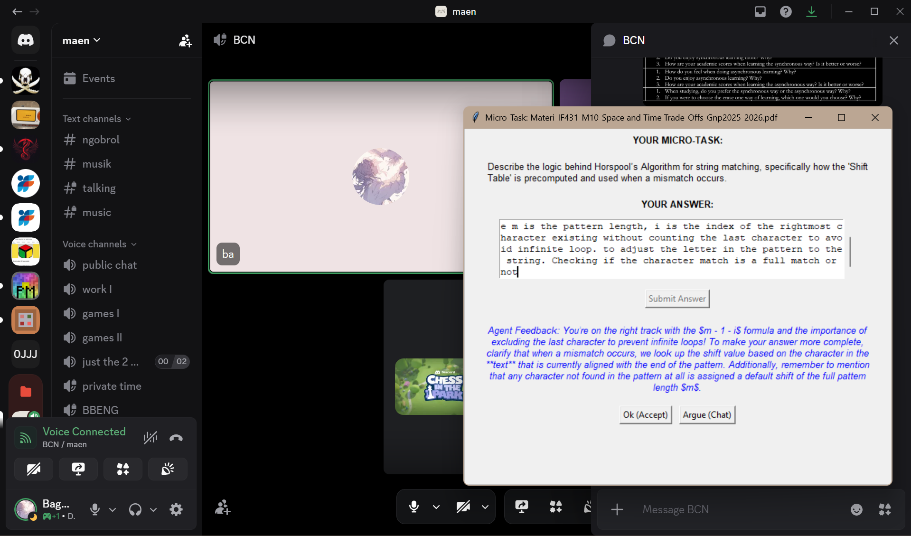
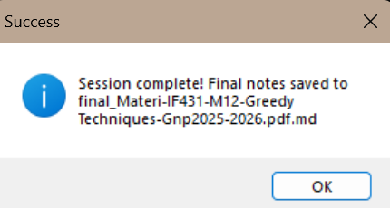
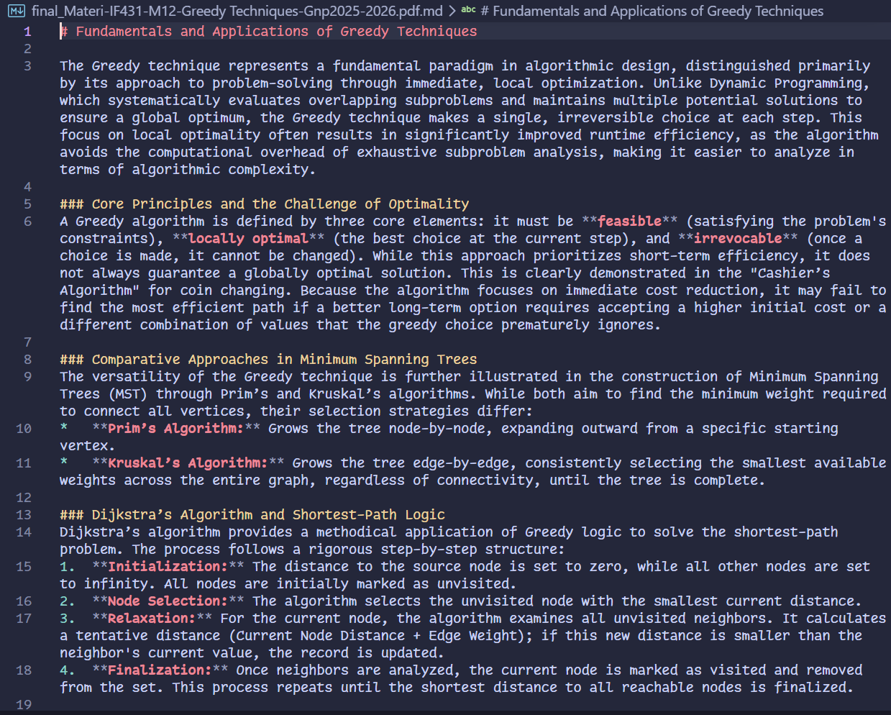

# UMicroassigNment - Anti-Procrastination Micro-Assignment Agent

Need to learn but don't feel like it? UMicroassigNment is here to help! This project is a proof-of-concept for an AI agent that breaks down large assignments or study materials into small, manageable tasks and delivers them to you via Windows toast notifications at randomized intervals. The goal is to make studying less overwhelming and more consistent, helping you stay on track without feeling like you're facing a mountain of work.

This project is made for students who want to stay on top of their studies without the stress of procrastination. By breaking down your materials into bite-sized pieces and prompting you regularly, UMNMicroassigNment helps you make steady progress and keeps you motivated.

## Features

- **Automated Decomposition**: The agent uses the Google Gemini API to analyze your study materials and break them down into 3-7 small tasks or questions.
- **Randomized Notifications**: You receive Windows Toast notifications at randomized intervals (15 min - 2 hours), prompting you to complete one small task.
- **Pinned Interactive Popup**: When a task is triggered, a non-intrusive popup appears. It is pinned on top of other windows to gently incentivize completion without taking up the entire screen, allowing you to stay focused on your environment while ensuring the task isn't ignored.
- **Progress Tracking**: The agent keeps track of your progress in a local JSON file, ensuring you can pick up where you left off.
- **Personalized Compilation**: Once all micro-tasks are completed, the agent compiles your answers into a cohesive, curated document. These notes are specifically designed to cover your personal knowledge gaps and are organized separately for each document you process.

## How It Works (Program Flow)

The agent follows a structured flow to ensure consistent progress:

1.  **Material Drops**: Drop your study materials (PDF, text, or markdown) into the `materials/` folder.
2.  **Decomposition**: The agent analyzes the content and breaks it into bite-sized tasks.
3.  **Micro-Prompting**: At randomized intervals, the agent prompts you with a task.


*Figure 1: Agent initialization and material sync.*


*Figure 2: Interactive pinned popup for micro-tasks.*


*Figure 3: Final compilation process.*

## Personalized Study Notes

The agent doesn't just summarize; it curates.

### Organized by Document
Your progress and final notes are kept separate for each material you upload, ensuring a clean and organized study environment.



*Notes are organized and tracked per document.*

### Curated for You
The final output is a polished academic document tailored to your learning style. It prioritizes covering your identified knowledge gaps, making it perfect for either completing an assignment or focused studying.



*Final notes covering knowledge gaps and providing a cohesive summary.*

## Prerequisites

- Python 3.8+
- Google Gemini API Key

## Installation

1. Install dependencies:
   ```bash
   pip install -r requirements.txt
   ```
2. Create a `.env` file with your API key:
   ```env
   GEMINI_API_KEY=your_actual_api_key_here
   ```

## Usage

1. Create the `materials/` folder if it doesn't exist.
2. Run the agent:

```bash
python agent.py
```

3. Drop a file (e.g., `chapter1.txt` or `Week10.pdf`) into the `materials/` folder.
4. Respond to the prompts in the terminal when you get a notification.

## Project Structure

- `agent.py`: Continuous background loop and notification timing.
- `llm.py`: Decomposition and compilation logic using Gemini.
- `tools.py`: Local folder monitoring and Windows notification triggers.
- `state.py`: Task queue management.
- `student_state.json`: Local database for progress tracking.
- `materials/`: Folder where you drop your study materials.

## Todo
- [ ] Make a watchdog to monitor the `materials/` folder for new files.
- [ ] Support for .docx and .pptx
- [ ] Make the code not Windows specific (Currently uses win10toast for notifications).
- [ ] Improve GUI (Maybe since it uses tkinter, design isnt the best).
- [x] add TTS for better interaction and accessibility.
